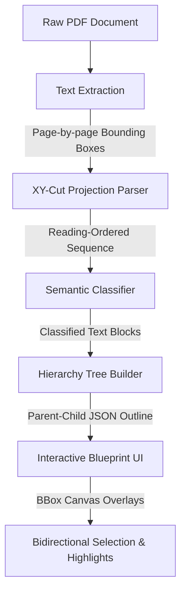

# 📐 SpecStream — Blueprint & Spec Sheet Segmenter

SpecStream is a layout-aware PDF document parser designed specifically for technical datasheets, blueprints, and engineering spec sheets. Standard PDF extractors flatten nested structures and read text in simple stream order, causing text to bleed across columns and rows. SpecStream solves this by applying a recursive **XY-Cut algorithm** to establish correct reading order, classifying text blocks semantically via **heuristics**, and building an **interactive tree hierarchy**.

This repository contains the Python-based extraction pipeline and the Vite/Vanilla CSS web application styled with a premium engineering blueprint aesthetic.

---

## 🚀 Key Features

*   **Recursive XY-Cut Parser:** Preserves multi-column and segmented text reading flows by dynamically partitioning space based on horizontal and vertical projection profiles.
*   **Semantic Heuristic Classifier:** Auto-categorizes blocks into `title`, `subtitle`, `heading1`, `heading2`, `spec`, `table-header`, `table-row`, `warning`, and `footnote`.
*   **Dynamic Hierarchy Reconstruction:** Generates nested parent-child trees using heading depths and structural context, exported as a clean JSON outline.
*   **Blueprint Web UI:** An interactive interface with a dark teal grid background, IBM Plex Mono typography, detail inspector strips, legend filtering, and bidirectional selection highlights (canvas bboxes ↔ tree nodes).
*   **PDF.js Integration:** Client-side rendering of PDF pages with absolute-positioned bounding box overlays.

---

## ⛓️ Pipeline Architecture



1. **Extraction:** Python extracts raw characters, coordinates (`x0, y0, x1, y1`), page numbers, and font sizes.
2. **XY-Cut:** Projection profile analysis dynamically computes gaps (based on median line height) and recursively cuts the page horizontally and vertically into reading columns.
3. **Classification:** Every text segment is assigned a category (e.g., `warning` based on icon/keyword match, `footnote` based on small font size).
4. **Hierarchy Builder:** Nodes are stacked and parented according to heading levels (`1` vs `1.1` etc.) and local context.
5. **Interactive UI:** The frontend renders pages, maps absolute overlay boxes on the canvas, and displays the hierarchy tree.

---

## 🛠️ Technology Stack

### Backend
*   **Language:** Python 3.10+
*   **Text Extraction:** PyMuPDF (`fitz`) / custom parser (`specstream.extraction`)
*   **Server:** Standard Python `http.server` running on port `8000`

### Frontend
*   **Core:** Vite, Vanilla HTML5, Vanilla CSS3 (Custom-designed blueprint aesthetic)
*   **Font:** IBM Plex Mono & IBM Plex Sans
*   **PDF Rendering:** `pdf.js` via CDN
*   **Interactions:** Bidirectional hover mapping, SVG page navigation, and responsive multi-pane layout

---

## 📂 Directory Structure

```
SpecStream/
├── specstream/                 # Python Core Pipeline
│   ├── extraction.py           # Text & coordinates extractor
│   ├── xycut.py                # Recursive spatial partitioner
│   ├── classification.py       # Semantic heuristic analyzer
│   ├── hierarchy.py            # Stack-based parent-child tree generator
│   └── pipeline.py             # Pipeline orchestrator
├── frontend/                   # Vite Single-Page Application
│   ├── src/
│   │   ├── main.js             # Logic, PDF.js integration, interactions
│   │   ├── style.css           # Vanilla CSS with blueprint styles & grid
│   │   └── api.js              # Fetch requests to local backend server
│   ├── index.html              # Frontend DOM layout
│   └── package.json            # NPM dependencies and dev scripts
├── server.py                   # Python HTTP API server (port 8000)
├── specstream-demo.html        # Original frontend visual prototype
├── DESIGN.md                   # Detailed design & style guide
├── ROADMAP.md                  # Project scope & upcoming features
└── README.md                   # Project documentation (this file)
```

---

## 🏃 Getting Started

To run SpecStream locally, you will need to start both the Python backend server and the Vite dev server.

### 1. Run the Python Backend
Ensure you have Python installed, then start the HTTP server from the root of the project:
```bash
python server.py
```
*The server will run on `http://localhost:8000` and process requests sent to `/process`.*

### 2. Run the Vite Frontend
Open a new terminal session, navigate to the `frontend` directory, install dependencies, and run the Vite server:
```bash
cd frontend
npm install
npm run dev
```
*The web interface will be available at `http://localhost:5173`.*

---

## 🎯 How to Use

1. **Access the App:** Open your browser to `http://localhost:5173`.
2. **Load Data:** Click **Load sample datasheet** to check out the preloaded blueprint specsheet, or click **Upload PDF** to process your own datasheet.
3. **Run Pipeline:** Click **Process Layout** to send the document to the Python backend layout engine.
4. **Interact:** 
    *   Hover over elements in the **Hierarchy** tree or **Reading order** list to highlight their corresponding bounding boxes on the canvas.
    *   Click on boxes directly on the canvas to inspect detail crumbs, exact text, and coordinates in the bottom inspector panel.
    *   Toggle between **XY-cut order** and **Naive scan order** to visually compare the reading sequences.
